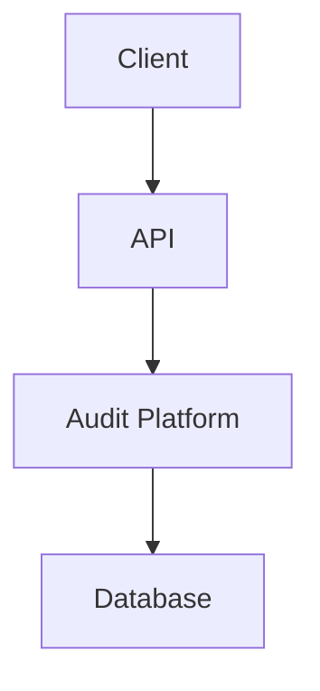

# Audit Platform Example

## Overview
Production-ready example of audit platform implementation.

## Architecture


## Implementation

### Core Logic
```typescript
// Implementation of audit platform
export async function processAudit Platform(data: Input): Promise<Output> {
  // Validation
  const validated = schema.parse(data);
  
  // Processing
  const result = await process(validated);
  
  // Return
  return {
    id: result.id,
    status: 'success',
    data: result,
  };
}
```

### Error Handling
```typescript
try {
  const result = await processAudit Platform(data);
  return result;
} catch (error) {
  if (error instanceof ValidationError) {
    return { status: 400, message: error.message };
  }
  if (error instanceof NotFoundError) {
    return { status: 404, message: 'Resource not found' };
  }
  console.error('Unexpected error:', error);
  return { status: 500, message: 'Internal server error' };
}
```

## Testing
```typescript
import { describe, it, expect } from 'vitest';

describe('Audit Platform', () => {
  it('processes valid input', async () => {
    const result = await processAudit Platform({ valid: true });
    expect(result.status).toBe('success');
  });
  
  it('rejects invalid input', async () => {
    await expect(processAudit Platform({ valid: false }))
      .rejects.toThrow(ValidationError);
  });
});
```

## Related
- [Pattern](../../patterns/audit-platform/)
- [Recipe](../../recipes/build-audit-platform/)
