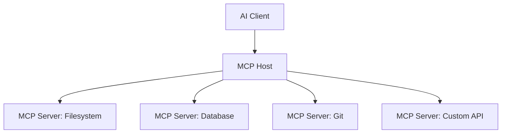

# Model Context Protocol (MCP)

## Overview

MCP is an open protocol for connecting AI assistants to external data sources and tools. It standardizes how AI systems discover and invoke capabilities.

## Architecture



## Server Development

### Setup
```bash
npm install @modelcontextprotocol/sdk
```

### Basic Server
```typescript
import { Server } from '@modelcontextprotocol/sdk/server/index.js';
import { StdioServerTransport } from '@modelcontextprotocol/sdk/server/stdio.js';

const server = new Server(
  { name: 'my-server', version: '1.0.0' },
  { capabilities: { tools: {} } }
);

// Define available tools
server.setRequestHandler(ListToolsRequestSchema, async () => ({
  tools: [{
    name: 'query_db',
    description: 'Execute read-only SQL query',
    inputSchema: {
      type: 'object',
      properties: {
        query: { type: 'string', description: 'SQL SELECT statement' }
      },
      required: ['query']
    }
  }]
}));

// Handle tool execution
server.setRequestHandler(CallToolRequestSchema, async (request) => {
  if (request.params.name === 'query_db') {
    const result = await db.execute(request.params.arguments.query);
    return { content: [{ type: 'text', text: JSON.stringify(result) }] };
  }
  throw new Error('Unknown tool');
});

const transport = new StdioServerTransport();
await server.connect(transport);
```

## Client Integration

```typescript
import { Client } from '@modelcontextprotocol/sdk/client/index.js';

const client = new Client({ name: 'ai-assistant', version: '1.0.0' });

// Connect to MCP server
const transport = new StdioClientTransport({
  command: 'node',
  args: ['mcp-database-server.js'],
});

await client.connect(transport);

// Discover tools
const tools = await client.listTools();

// Use tool
const result = await client.callTool({
  name: 'query_db',
  arguments: {
    query: 'SELECT COUNT(*) FROM users'
  }
});
```

## Security

- Validate all inputs
- Scope servers to specific functions
- Audit all tool invocations
- Implement rate limiting
- Never expose write operations without confirmation

## Resources

- [MCP Specification](https://modelcontextprotocol.io)
- [MCP SDK Docs](https://github.com/modelcontextprotocol)
