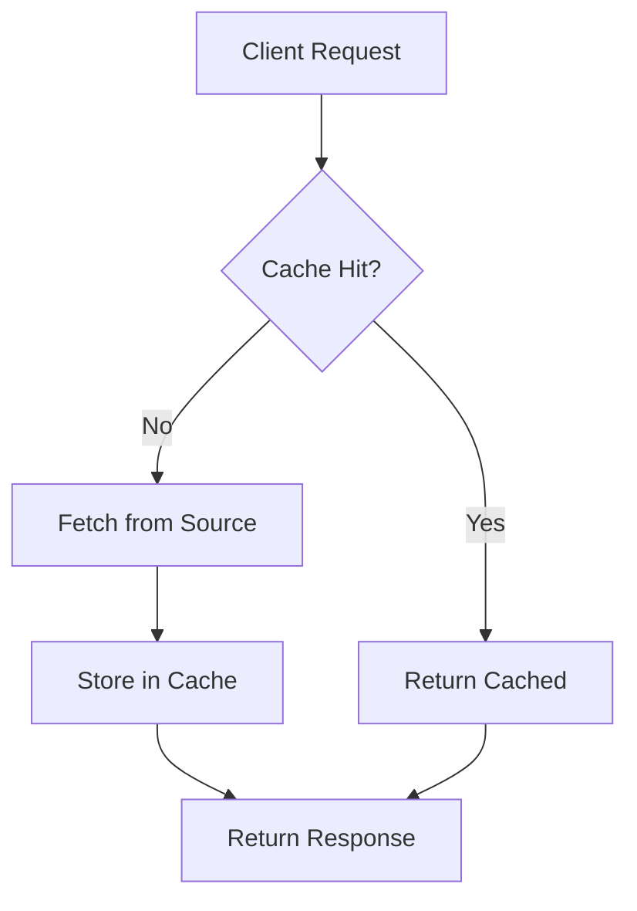

# Solution: Caching Architecture

## Architecture



## Implementation

### Redis Cache Layer

```typescript
// lib/cache.ts
import Redis from 'ioredis';

const redis = new Redis({
  host: process.env.REDIS_HOST,
  port: parseInt(process.env.REDIS_PORT || '6379'),
  retryStrategy: (times) => Math.min(times * 50, 2000),
});

export async function getOrSet<T>(
  key: string,
  factory: () => Promise<T>,
  ttl: number = 3600
): Promise<T> {
  const cached = await redis.get(key);
  if (cached) {
    return JSON.parse(cached) as T;
  }
  
  const value = await factory();
  await redis.setex(key, ttl, JSON.stringify(value));
  return value;
}

export async function invalidate(pattern: string) {
  const keys = await redis.keys(pattern);
  if (keys.length > 0) {
    await redis.del(...keys);
  }
}
```

### React Query Integration

```tsx
// hooks/useUser.ts
import { useQuery, useMutation, useQueryClient } from '@tanstack/react-query';

export function useUser(userId: string) {
  return useQuery({
    queryKey: ['user', userId],
    queryFn: () => fetchUser(userId),
    staleTime: 5 * 60 * 1000, // 5 minutes
    cacheTime: 30 * 60 * 1000, // 30 minutes
  });
}

export function useUpdateUser() {
  const queryClient = useQueryClient();
  
  return useMutation({
    mutationFn: updateUser,
    onSuccess: (data) => {
      // Invalidate and refetch
      queryClient.invalidateQueries({ queryKey: ['user', data.id] });
    },
  });
}
```

## Cache Strategies

| Strategy | Use Case | TTL |
|----------|----------|-----|
| **Cache-Aside** | Read-heavy, eventual consistency | 1h |
| **Write-Through** | Read-heavy, strong consistency | 5m |
| **Write-Behind** | Write-heavy, async processing | 1h |

## Anti-Patterns

- Cache stampede (thundering herd)
- No cache invalidation
- Storing sensitive data unencrypted
- Ignoring cache failures (fallback missing)


## Related
- `05-execution/rules/nextjs/patterns.md` — Next.js patterns
- `05-execution/rules/postgres/performance.md` — Database patterns
- `08-recipes/build-cache/` — Build recipes
- `09-boilerplates/cache/` — Starter templates
