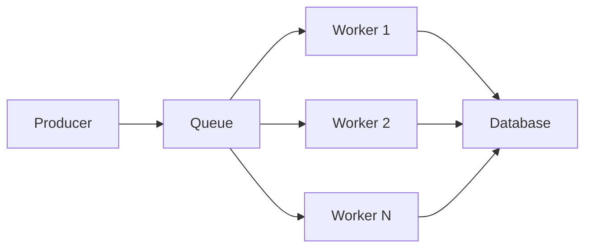

---
tags:
  - anti-patterns
  - best-practices
  - database
  - nextjs
  - performance
  - postgres
  - react
  - sql
summary: "Solution: Queue Architecture"
read_when:
  - "Designing queue architecture"
  - "Reviewing queue implementation"
---

# Solution: Queue Architecture

## Architecture



## Implementation

### BullMQ with Redis

```typescript
// lib/queue.ts
import { Queue, Worker } from 'bullmq';

const emailQueue = new Queue('emails', {
  connection: { host: process.env.REDIS_HOST },
  defaultJobOptions: {
    attempts: 3,
    backoff: { type: 'exponential', delay: 5000 },
    removeOnComplete: 100,
    removeOnFail: 50,
  },
});

// Producer
export async function sendEmail(data: EmailData) {
  await emailQueue.add('send', data, {
    priority: data.urgent ? 1 : 10,
    delay: data.scheduledFor ? data.scheduledFor.getTime() - Date.now() : 0,
  });
}

// Worker
const worker = new Worker('emails', async (job) => {
  console.log(`Processing job ${job.id}: ${job.name}`);
  await emailService.send(job.data);
}, {
  connection: { host: process.env.REDIS_HOST },
  concurrency: 5,
});

// Error handling
worker.on('failed', (job, err) => {
  console.error(`Job ${job?.id} failed:`, err);
  // Alert on critical failures
});
```

### Dead Letter Queue

```typescript
const deadLetterQueue = new Queue('failed-jobs');

worker.on('failed', async (job, err) => {
  if (job?.attemptsMade >= 3) {
    await deadLetterQueue.add('failed', {
      originalJob: job.data,
      error: err.message,
      failedAt: new Date(),
    });
  }
});

// Retry from dead letter
async function retryFailedJob(jobId: string) {
  const job = await deadLetterQueue.getJob(jobId);
  if (job) {
    await emailQueue.add(job.data.originalJob);
    await job.remove();
  }
}
```

## Monitoring

```typescript
// Dashboard metrics
const metrics = await emailQueue.getJobCounts('waiting', 'active', 'completed', 'failed');
console.log('Queue status:', metrics);
```

## Anti-Patterns

- No retry logic (fail permanently)
- Processing in HTTP request (blocks response)
- No idempotency (duplicate processing)
- Ignoring poison pills (crash worker)


## Related
- `05-execution/rules/nextjs/patterns.md` — Next.js patterns
- `05-execution/rules/postgres/performance.md` — Database patterns
- `08-recipes/build-queue/` — Build recipes
- `09-boilerplates/queue/` — Starter templates
