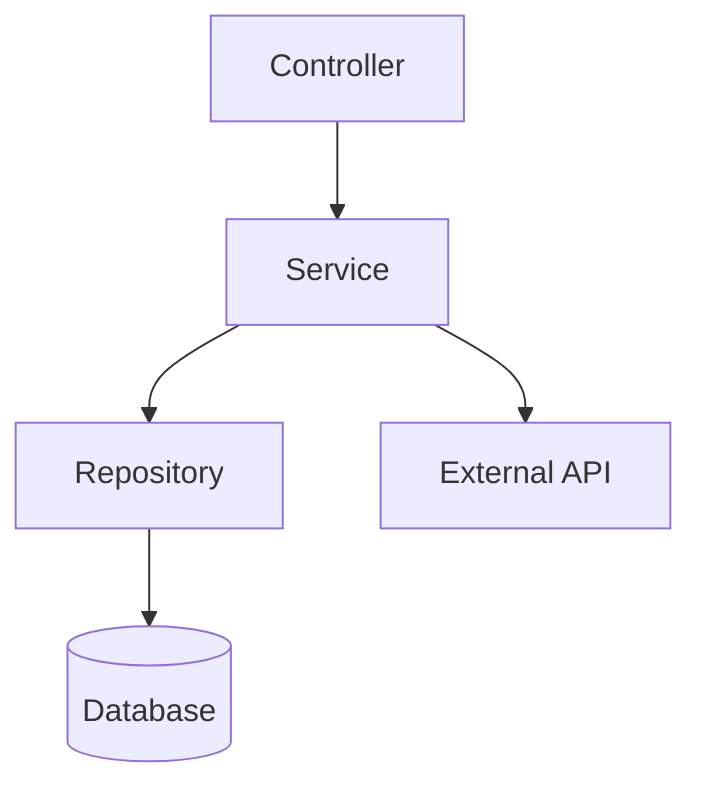

# Solution: Service Layer Pattern

## Architecture

```
Controller (HTTP/CLI/WebSocket)
    │
    ▼
Service (Business Logic)
    │
    ├─── Repository (Data Access)
    ├─── External API Client
    └─── Event Bus
```

## Implementation

```typescript
// services/OrderService.ts
interface CreateOrderInput {
  userId: string;
  items: Array<{ productId: string; quantity: number }>;
}

export class OrderService {
  constructor(
    private orderRepository: OrderRepository,
    private productRepository: ProductRepository,
    private paymentGateway: PaymentGateway,
    private eventBus: EventBus,
  ) {}

  async createOrder(input: CreateOrderInput): Promise<Order> {
    // Validate
    if (!input.items?.length) {
      throw new ValidationError('Order must contain items');
    }

    // Fetch products and validate stock
    const products = await this.productRepository.findByIds(
      input.items.map(i => i.productId)
    );

    const orderItems = this.buildOrderItems(input.items, products);
    const total = this.calculateTotal(orderItems);

    // Create order in transaction
    const order = await this.orderRepository.createInTransaction(async (trx) => {
      const newOrder = await trx.orders.create({
        userId: input.userId,
        items: orderItems,
        total,
        status: 'pending',
      });

      // Deduct stock
      for (const item of orderItems) {
        await trx.products.decrementStock(item.productId, item.quantity);
      }

      return newOrder;
    });

    // Process payment (outside transaction — external service)
    try {
      await this.paymentGateway.charge({
        orderId: order.id,
        amount: total,
        customerId: input.userId,
      });
    } catch (error) {
      await this.orderRepository.updateStatus(order.id, 'payment_failed');
      throw new PaymentError('Payment failed', { cause: error });
    }

    // Publish event
    await this.eventBus.publish('order.created', {
      orderId: order.id,
      userId: input.userId,
      total,
    });

    return order;
  }

  private buildOrderItems(
    items: CreateOrderInput['items'],
    products: Product[],
  ): OrderItem[] {
    return items.map(item => {
      const product = products.find(p => p.id === item.productId);
      if (!product) throw new ValidationError(`Product ${item.productId} not found`);
      if (product.stock < item.quantity) {
        throw new ValidationError(`Product ${product.name} out of stock`);
      }

      return {
        productId: item.productId,
        quantity: item.quantity,
        unitPrice: product.price,
      };
    });
  }

  private calculateTotal(items: OrderItem[]): number {
    const subtotal = items.reduce((sum, item) => sum + item.unitPrice * item.quantity, 0);
    return subtotal > 100 ? subtotal * 0.9 : subtotal; // 10% discount over $100
  }
}
```

## Controller (Thin)

```typescript
// controllers/OrderController.ts
export class OrderController {
  constructor(private orderService: OrderService) {}

  async create(req: Request, res: Response) {
    try {
      const order = await this.orderService.createOrder(req.body);
      res.status(201).json(order);
    } catch (error) {
      if (error instanceof ValidationError) {
        return res.status(400).json({ error: error.message });
      }
      if (error instanceof PaymentError) {
        return res.status(402).json({ error: error.message });
      }
      throw error;
    }
  }
}
```

## Testing

```typescript
// services/OrderService.test.ts
import { describe, it, expect, vi } from 'vitest';

describe('OrderService', () => {
  it('calculates discount for orders over $100', async () => {
    const mockRepo = { createInTransaction: vi.fn() };
    const service = new OrderService(
      mockRepo as any,
      { findByIds: vi.fn().mockResolvedValue([{ id: '1', price: 60, stock: 10 }]) } as any,
      { charge: vi.fn() } as any,
      { publish: vi.fn() } as any,
    );

    await service.createOrder({
      userId: 'user-1',
      items: [{ productId: '1', quantity: 2 }], // $120 → $108 after discount
    });

    expect(mockRepo.createInTransaction).toHaveBeenCalledWith(
      expect.objectContaining({ total: 108 })
    );
  });
});
```

## Anti-Patterns

- **Anemic Services**: Only CRUD, no business logic
- **Leaky Transactions**: External API calls inside DB transactions
- **No Validation**: Accepting any input
- **Hidden Side Effects**: Modifying state unexpectedly


## Related
- `05-execution/rules/nextjs/patterns.md` — Next.js patterns
- `05-execution/rules/postgres/performance.md` — Database patterns
- `08-recipes/build-service/` — Build recipes
- `09-boilerplates/service/` — Starter templates


## Architecture Diagram


